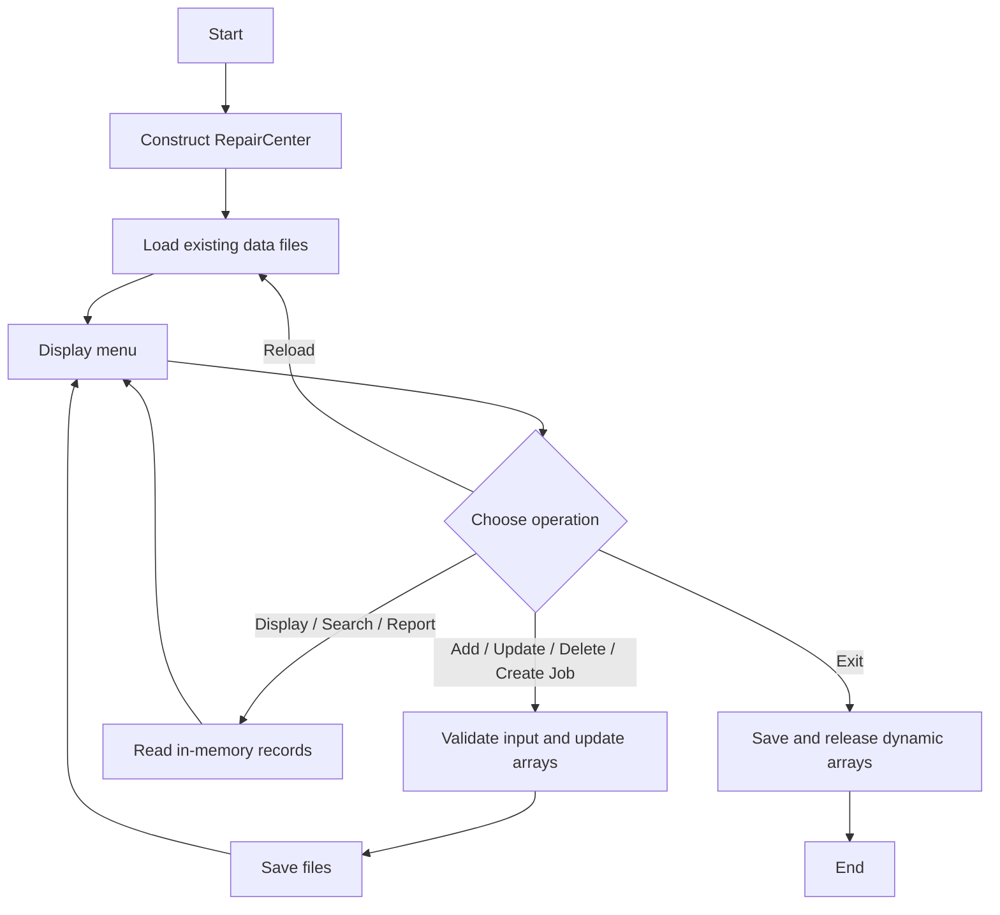

# Program workflow

```mermaid
flowchart TD
 A[Start] --> B[Construct RepairCenter]
 B --> C[Load existing data files]
 C --> D[Display menu]
 D --> E{Choose operation}
 E -->|Add / Update / Delete / Create Job| F[Validate input and update arrays]
 F --> G[Save files]
 G --> D
 E -->|Display / Search / Report| H[Read in-memory records]
 H --> D
 E -->|Reload| C
 E -->|Exit| I[Save and release dynamic arrays]
 I --> J[End]
```
